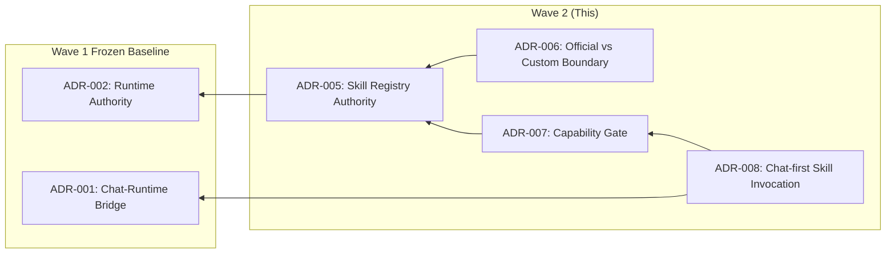

# ADR Wave 2 — Decision Context

**Session**: ANL-adr-wave-2-2026-05-13
**Date**: 2026-05-13
**Upstream**: runtime-constitution-v0.8, capability-gate-p0, official-skill-boundary-p0

---

## Locked Decisions（冻结，不可修改）

| # | Decision | Source ADR | Rationale |
|---|----------|-----------|-----------|
| L1 | SkillRegistry 是 Skill 元数据层的单一权威来源 | ADR-005 | discover + cache + resolve 三职责，不延伸 |
| L2 | Registry 不做 load markdown、match、execute、policy | ADR-005 | 职责边界清晰，避免膨胀 |
| L3 | Official Skill 和 Custom Skill 物理隔离在两棵独立目录树 | ADR-006 | Official (Resource) vs Custom (AppData) |
| L4 | Custom 不可覆盖 Official，冲突时保留 Official + warning | ADR-006 | 安全策略，不可协商 |
| L5 | Official Skill 的只读保护依赖 tauri resource 机制 | ADR-006 | resources + fs.scope.allow 已配置 |
| L6 | Capability Gate 在 skillBridge（invocation 入口）执行 pre-check | ADR-007 | 靠近调用方，阻断及时 |
| L7 | DEFAULT_ALLOWED_CAPABILITIES 是系统级默认 policy | ADR-007 | ['llm', 'image_generation', 'filesystem.read'] |
| L8 | skillBridge 是 Chat 层调用 Skill 的唯一模块 | ADR-008 | tryExecuteSkill 是唯一个人口 |
| L9 | Skill 执行走 Runtime 路径（executeChatTask），不走 WebSocket | ADR-008 | 架构事实 |

## Free Decisions（可调整，无需 ADR supersede）

| # | Decision | Scope | Adjustment Condition |
|---|----------|-------|---------------------|
| F1 | SkillRegistry 使用模块级单例模式 | skillBridge.ts | 如需依赖注入可改为实例化管理 |
| F2 | discoverSkills 是 eager load（首次调用触发） | skillRegistry.ts | 可改为应用启动时预加载 |
| F3 | console.warn 作为冲突提示级别 | skillRegistry.ts | 可改为 console.error 或 silent |
| F4 | SkillLoader 构造时写死 source: 'custom' | skillLoader.ts | 如需可为 Loader 添加 source 参数 |
| F5 | DEFAULT_ALLOWED_CAPABILITIES 的具体列表 | capability.ts | 可根据产品策略调整默认值 |
| F6 | checkSkillCapabilities 签名（validate → boolean） | skillBridge.ts | 可返回详细错误信息 |

## Deferred Decisions（推迟，Wave 2 不做）

| # | Decision | Why Deferred | Future Trigger |
|---|----------|-------------|----------------|
| D1 | Prompt 保护（Official SKILL.md 防篡改） | tauri resource 天然只读，应用层保护待定 | Custom skill 注入 attack 场景 |
| D2 | Category 过滤/分类 | 当前无 category 字段，不阻塞 P0 | UI 需要 skill 分类时 |
| D3 | Entitlement 细粒度权限控制 | 可能 supersede ADR-007 | 多用户/企业版需求 |
| D4 | Skill 更新机制/热重载 | discover 一次加载，无 watch | 动态安装/卸载场景 |
| D5 | Directory watch | 无 | 需要热更新时 |
| D6 | Remote/Marketplace skill | 无 | 平台化需求 |
| D7 | Skill 组合/编排 | 7 条 red lines 已禁止 | 不进入 roadmap |

## ADR Dependency Graph

## Write Order

1. **ADR-005** — Skill Registry Authority（基础，无依赖）
2. **ADR-006** — Official vs Custom Boundary（依赖 Registry 的双目录机制）
3. **ADR-007** — Capability Gate（依赖 Registry 获取 capabilities）
4. **ADR-008** — Chat-first Skill Invocation（依赖 Bridge 和 Capability Gate）

Wave 1（ADR-005 + ADR-006）可并行写入。
Wave 2（ADR-007 + ADR-008）可并行写入。

## Gray Areas

1. **ADR-005 vs ADR-006 边界重叠**：Registry 使用双 BaseDirectory 是 ADR-005 的 implementation，但冲突保留 Official 是 ADR-006 的安全策略。建议：ADR-005 描述"双目录"机制，ADR-006 描述"冲突规则"的安全含义。

2. **ADR-007 冻结状态**：明确标记为 frozen = false。Entitlement 系统可能 supersede ADR-007，但 DEFAULT_ALLOWED_CAPABILITIES 的默认值应持续存在作为 fallback。

3. **ADR-008 的 scope**：是"current state"而非"constraint"。如果未来 Skill 获得 Runtime-native 入口（非 chat），ADR-008 将被 supersede。
