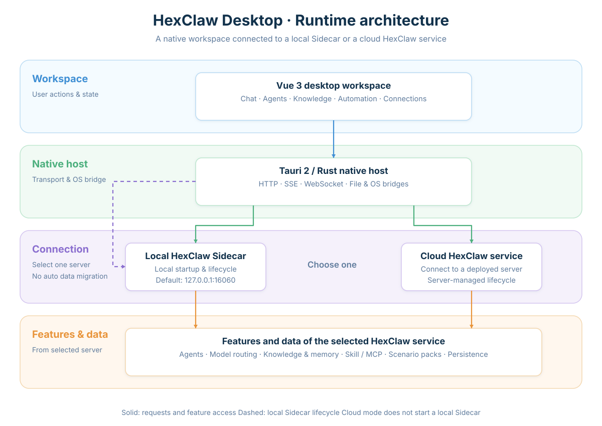
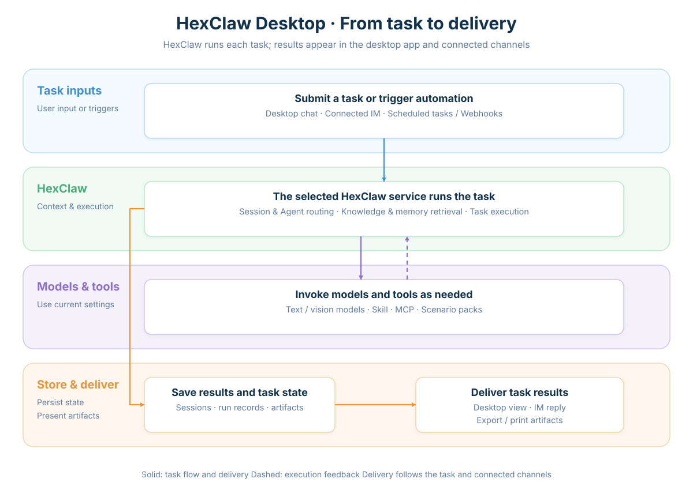

<div align="center">


# HexClaw Desktop

**A native AI Agent workspace for conversations, agents, knowledge, tools, and automation.**

[](https://github.com/hexagon-codes/hexclaw-desktop/actions/workflows/ci.yml)
[](https://github.com/hexagon-codes/hexclaw-desktop/releases)
[](LICENSE)

[Install](#installation) · [First use](#first-use) · [Website](https://hexclaw.net) · [User guide](docs/guide.en.md) · [Download](https://github.com/hexagon-codes/hexclaw-desktop/releases) · [中文](README.md)

</div>

HexClaw Desktop connects a desktop application to the [HexClaw](https://github.com/hexagon-codes/hexclaw) Agent service. Use the local service managed by the app, or connect to a cloud service you deploy yourself. Start tasks through desktop conversations, connected IM channels, or automation, and let agents use models, knowledge, and tools to produce results you can inspect, save, and deliver.

The app uses **Tauri 2 + Vue 3 + TypeScript**, with a Go Sidecar running the local Agent service. Ollama is available for local models; online models require network access and credentials for the selected Provider.

> This README describes the current source code. Published installers contain the code for their release, so the latest source and released packages may differ.


The real interface and K12 skin are reused from the [official K12 tutorial (Chinese)](https://hexclaw.net/zh/docs/k12). The tutorial covers Desktop `v0.5.0-beta.3` / HexClaw `v0.5.0-beta.1`; its screenshots retain the `v0.5.0-beta` scenario baseline. Homework material is an **AI-generated example, not real student work**.

## Contents

- [Installation](#installation)
- [First use](#first-use)
- [Core capabilities](#core-capabilities)
- [Runtime architecture](#runtime-architecture)
- [From task to delivery](#from-task-to-delivery)
- [Source development](#source-development)
- [Claude Code development SOP](#claude-code-development-sop)
- [Documentation and ecosystem](#documentation-and-ecosystem)
- [Contributing](#contributing)
- [Contact](#contact)
- [License](#license)

## Installation

### Runtime requirements

- **macOS**: bundled local inference and document rendering components require macOS 14 or later; Apple Silicon and Intel are supported. The app shell's configured macOS 11 minimum does not describe compatibility for those components.
- **Windows / Linux**: current release targets are x86_64. Linux builds use Ubuntu 22.04 and require Tauri dependencies such as WebKitGTK 4.1.
- **Models**: online models require network access and credentials for the selected Provider. macOS installers include Ollama; Windows and Linux users need to install [Ollama](https://ollama.com/download) and download a model to use local models.

Use the assets and version requirements of your selected [Release](https://github.com/hexagon-codes/hexclaw-desktop/releases). Installers do not require Node.js, Rust, or Go.

### macOS: one-line install (recommended)

Run the following command in your terminal:

```bash
curl -fsSL https://raw.githubusercontent.com/hexagon-codes/hexclaw-desktop/bb3c12ec91eec91798b67c292bc8c85c4481dc2b/install.sh | bash
```

The script detects Apple Silicon or Intel, downloads a published installer, including prereleases, and installs it to `/Applications/HexClaw.app`. Open it from Launchpad or run `open -a HexClaw`.

### macOS: Homebrew

```bash
brew tap hexagon-codes/tap
brew install --cask hexclaw
```

Upgrade an existing installation:

```bash
brew upgrade --cask hexclaw
```

macOS releases do not use Apple Developer ID signing or notarization. The installation script and Homebrew Cask handle app installation. If macOS blocks a manually downloaded app, see the [macOS guidance in the user guide](docs/guide.en.md#macos-security-warning).

### macOS, Windows, and Linux: installers

Choose a release and the asset for your platform from [GitHub Releases](https://github.com/hexagon-codes/hexclaw-desktop/releases):

| Platform | Architecture | Format |
| --- | --- | --- |
| macOS | Apple Silicon / Intel | `.dmg` |
| Windows | x86_64 | `.exe` (NSIS) |
| Linux | x86_64 | `.deb` / `.AppImage` |

Release builds cover these four targets; download the assets actually provided by the selected release.

## First use

1. **Choose a service.** Select the local service during setup, or enter the address and access token for your cloud HexClaw service.
2. **Check the model.** Start a task directly if the active service already has a working default model; otherwise open model settings. For online models, enter the required credentials and address and test the connection. For local models, confirm that Ollama and a downloaded model are available; no cloud API Key is needed.
3. **Start a task.** Send a message or attachment in Chat. Create an Agent instance when you need a specialized role, and configure knowledge, Skills, MCP, or connections when you need private information or external tools.

Try: “List three open-source README checks in Markdown: quick start, API contracts, and version consistency.” **Receiving a complete response, with the input ready for another message**, means this conversation has completed. A successful model connection check alone does not prove task completion.

The app manages startup and shutdown of the local service. The server manages the cloud service. When the server, models, and connected IM remain available, shutting down your computer does not stop cloud tasks.

**Local and cloud services keep separate conversations, learning records, model settings, and connections. Switching services does not automatically migrate or merge data.** Online models receive the task content sent to them; data handling depends on the selected Provider.

### Homework tutoring

The current homework tutoring scenario targets primary school. Create a homework tutor from the Agent templates, complete the child profile, and send homework images in that instance's tutoring conversation. Image tasks progress automatically to their results. Recognizable content is processed normally, while content that cannot be read reliably is marked as unrecognizable.

Homework-image grading is complete when you **receive and can view the original image with annotations**. Recognition text or an intermediate processing state does not indicate completed grading. See the [official K12 tutorial (Chinese)](https://hexclaw.net/zh/docs/k12) for a full walkthrough and more screenshots.

Learning records retain mistakes and notes, learning insights summarize progress, and weekly practice combines textbooks, curriculum progress, and existing learning records. The current source supports curriculum progress estimates and preserves the source of manually adjusted progress. Available textbooks and exercise coverage depend on the materials available to the service.

### First-use troubleshooting

| Symptom | Where to check |
| --- | --- |
| macOS blocks a manually downloaded app | [macOS security warning](docs/guide.en.md#macos-security-warning) |
| Service disconnected or engine stopped | [Service troubleshooting](docs/guide.en.md#engine-status-red-engine-stopped): check local processes, or the cloud address and access token |
| Connected, but no response or output received | [Chat not responding](docs/guide.en.md#chat-not-responding): check the active service's model settings and task logs |

## Core capabilities

| Capability | What you can do |
| --- | --- |
| Conversations and results | Multi-turn conversations, streaming responses, attachments, model selection, and reasoning settings; render Markdown, code, math, and chemical formulas, and inspect generated files and Artifacts. |
| Agents and scenarios | Manage roles, templates, and the default Agent, configure channel routing in Connections, and attach specialized capabilities to Agent instances through scenario packs. |
| K12 homework tutoring | Create separate child profiles; solve and grade work from images, review writing and artwork, maintain mistakes and learning notes, generate weekly practice and learning reports, and receive annotated images, exercises, and exports. |
| Knowledge and memory | Upload and manage documents, inspect processing status, retry failed tasks, retrieve context through full-text and vector search, and manage persistent memory. |
| Tools and integrations | Manage Skills, the skill marketplace, MCP services, and Prompts in Capabilities; let agents use configured external tools and services. |
| Automation | Create scheduled tasks, Webhooks, and workflows that run on schedules or events. |
| Connections | Manage IM channels, accounts, and data connectors, and route external messages into Agent execution. |
| Desktop experience and diagnostics | System tray, Quick Chat, notifications, file previews, exports, and printing; inspect runtime logs and service status. |

Models can be connected through Providers such as OpenAI, Anthropic, Gemini, DeepSeek, and Qwen, as well as OpenAI-compatible APIs. Ollama supports local models. Available models, input types, and tool capabilities depend on the active service configuration and Provider support.

## Runtime architecture



| Layer | Responsibility |
| --- | --- |
| Vue workspace | Present Chat, Agents, Knowledge, Automation, Connections, Capabilities, Logs, and Settings. |
| Tauri native host | Manage windows, the tray, notifications, files, and system operations; handle HTTP, SSE, and WebSocket transport. |
| Local HexClaw Sidecar | Execute Agent and business tasks on the current device, using `localhost:16060` by default; the app manages its lifecycle. |
| Cloud HexClaw service | Execute tasks and store business data on the deployed server; the desktop connects using the service address and access token. |
| Models, knowledge, and tools | Use configured Providers, retrieval, memory, Skills, MCP, and scenario capabilities as required by the task. |

Local and cloud modes share the same desktop task entry points. Cloud mode still uses the local Tauri host for file selection, previews, and system operations, but launching the app does not start a local HexClaw Sidecar or managed Ollama. Task requests go to the selected cloud service.

Local process management and internal interfaces apply only to the local service. Models, tools, and data connectors access resources available in **the environment where the executing service runs**. Connecting to a cloud service does not automatically provide access to the computer's local filesystem or tool environment.

Local Provider settings and API Keys are persisted in `~/.hexclaw/hexclaw.yaml`; the local service stores business data. Installers also provide Pandoc and Typst for document rendering in supported tasks. See [THIRD_PARTY.md](THIRD_PARTY.md) for bundled component details.

## From task to delivery



Desktop conversations, connected IM, and automation provide task entry points. Agents use knowledge, memory, and tools according to their role and task. Execution status and results are stored by the active service. The desktop presents responses and files, IM tasks return results through their channel, and exports or printing are available where supported by the task.

Homework tutoring returns annotated images, explanations, learning records, or exercise documents, depending on the task. Results can be viewed on the desktop or received through connected channels.

Download the diagrams: [Architecture PNG](.github/assets/desktop-architecture.en.png) · [Task workflow PNG](.github/assets/desktop-task-workflow.en.png).

## Source development

### Requirements

| Tool | Requirement |
| --- | --- |
| Node.js | Version 20 from `20.19.0` onward, or `22.12.0` and later; CI uses Node.js 22. |
| pnpm | `10.30.3`, pinned in `package.json`. |
| Rust | `1.94.0`, pinned in `rust-toolchain.toml`. |
| Go | 1.25.13 or later to build the current mainline HexClaw Sidecar; use the selected backend version's `go.mod` for other versions. |
| System tools | Git and Make; downloading rendering components also requires Python 3 and curl. |
| Platform dependencies | Install the system dependencies listed in the [Tauri 2 prerequisites](https://v2.tauri.app/start/prerequisites/). |

### macOS quick start

```bash
git clone https://github.com/hexagon-codes/hexclaw-desktop.git
cd hexclaw-desktop

pnpm install --frozen-lockfile

make sidecar
make render-bundle
make ollama

make dev
```

The commands build the backend version selected by the Makefile, prepare bundled components, and launch the Vue development server and Tauri window.

`make sidecar` uses `HEXCLAW_REF` from the `Makefile`; it does not automatically select the latest backend source. To use the latest backend main branch, run:

```bash
make sidecar HEXCLAW_REF=origin/main
```

Set `HEXCLAW_REF` to a tag or commit when you need another backend version. See the [Release workflow](.github/workflows/release.yml) for Windows and Linux native build dependencies and bundled component preparation. The `make render-bundle` quick-start command above applies to macOS.

### Use local ecosystem source

When developing the backend and desktop together, place `hexclaw`, `ai-core`, `hexagon`, and `toolkit` beside the desktop repository, reference those modules in a `go.work` file in the parent directory, and run:

```bash
make sidecar-local
make render-bundle
make ollama
make dev
```

`make sidecar-local` builds the backend from the local Go workspace, including committed code and uncommitted changes. Rebuild the Sidecar after changing Go code. In development mode, the Vue frontend uses Vite hot updates.

### Common commands

| Command | Purpose |
| --- | --- |
| `pnpm dev` | Start only the frontend development server; an accessible HexClaw service is required. |
| `make dev` | Start Tauri desktop development mode. |
| `make sidecar` | Build the selected backend version's Sidecar for the current platform. |
| `make sidecar-local` | Build the latest local Sidecar from the sibling Go workspace. |
| `pnpm type-check` | Check TypeScript and Vue types. |
| `pnpm lint` | Run oxlint and ESLint. |
| `pnpm build` | Check types and build the frontend. |
| `make build` | Generate native installers using prepared bundled components. |
| `make package-local` | Rebuild from the complete local ecosystem workspace and generate local installation artifacts on macOS. |

`make build` also generates updater artifacts by default and requires a matching Tauri updater signing key. For a local manually installable package, follow [Local Packaging](docs/updates.en.md#local-packaging) to disable updater artifact generation for that build without changing project defaults or the release flow.

### Code guide

| Path | Contents |
| --- | --- |
| [`src/views/`](src/views/) | Workspace pages. |
| [`src/features/`](src/features/) | Scenario features and domain views, including K12. |
| [`src/api/`](src/api/) | Service APIs and native transport adapters. |
| [`src/components/`](src/components/) | Shared interaction and presentation components. |
| [`src-tauri/src/`](src-tauri/src/) | Native host, service connections, process management, and file bridging. |
| [`release/`](release/) | Bundled rendering components and release preparation scripts. |
| [`.github/workflows/`](.github/workflows/) | CI and multiplatform release builds. |

## Claude Code development SOP

This repository also documents the actual workflow used to develop HexClaw with Claude Code. The design-driven development, verification, and multi-agent collaboration methods, along with reusable commands, Hooks, Skills, and templates, are open source.

- **WeChat article (Chinese):** [The Claude Code SOP Behind HexClaw AI: Design-Driven Development × Verification × Multi-Agent Collaboration](https://mp.weixin.qq.com/s/1rza-Ye3NF89KNAJp_PttA), covering the development process and practical methods for these three areas.
- **Open-source SOP package:** [`docs/claude-code-practices/`](docs/claude-code-practices/), containing 4 practical manuals, 7 Claude Code commands, 3 Hooks, a DevTestOps Skill, and CLAUDE.md templates.

| Area | Practice |
| --- | --- |
| Design-driven development | Clarify requirements and options, compare tradeoffs, and record design decisions in ADRs. |
| Verification | Choose checks based on the actual changes and confirm completion using execution results and real artifacts. |
| Multi-agent collaboration | Claude writes code, Codex reviews it, and people make decisions; independent reviews provide additional evidence. |

From the repository directory, copy the SOP package into your personal Claude Code configuration directories. See the [SOP instructions (Chinese)](docs/claude-code-practices/README.md) for file purposes and Hook configuration.

```bash
mkdir -p ~/.claude/commands ~/.claude/data ~/.claude/skills ~/.claude/hooks
cp docs/claude-code-practices/command/*.md ~/.claude/commands/
cp docs/claude-code-practices/data/*.md ~/.claude/data/
cp -r docs/claude-code-practices/skill/devtestops ~/.claude/skills/
cp docs/claude-code-practices/hooks/*.sh ~/.claude/hooks/
chmod +x ~/.claude/hooks/*.sh
```

## Documentation and ecosystem

| Resource | Contents |
| --- | --- |
| [Website](https://hexclaw.net) | Product information, installation instructions, and release downloads. |
| [Chinese Docs](https://hexclaw.net/zh/docs/) / [English Docs](https://hexclaw.net/en/docs/) | Official tutorials and feature documentation. |
| [User guide](docs/guide.en.md) | Installation, module usage, shortcuts, and troubleshooting. |
| [Product overview](docs/overview.en.md) | Workspace modules and usage paths. |
| [Update instructions](docs/updates.en.md) | App updates and release artifact requirements. |
| [Changelog](CHANGELOG.md) | Changes by release. |

The HexClaw ecosystem spans general libraries, model integration, and Agent orchestration, through to the service, desktop workspace, and skill marketplace:

| Project | Role and capabilities | Technology |
| --- | --- | --- |
| [toolkit](https://github.com/hexagon-codes/toolkit) | General Go library: generic collections, concurrency, HTTP/SSE, caching and configuration, logging, databases, object storage, and command sandboxing | Go |
| [ai-core](https://github.com/hexagon-codes/ai-core) | AI foundation: unified model integration, tool calling, streaming and structured output, model routing, Embedding, and image, video, and speech capabilities | Go |
| [Hexagon](https://github.com/hexagon-codes/hexagon) | AI Agent framework: tool calling, graph orchestration, multiple Agents, RAG, durable execution, and MCP, A2A, and OpenTelemetry integration | Go |
| [HexClaw](https://github.com/hexagon-codes/hexclaw) | Self-hostable AI Agent service: multiple models, tools, knowledge bases, long-term memory, and task automation, with API and multi-platform IM access | Go |
| [HexClaw Desktop](https://github.com/hexagon-codes/hexclaw-desktop) (this repository) | AI Agent desktop workspace: connects to local or cloud HexClaw services and brings together chat, knowledge bases, tools, task automation, and K12 homework tutoring | Tauri 2, Vue 3, TypeScript, Rust |
| [HexClaw Hub](https://github.com/hexagon-codes/hexclaw-hub) | Skill and tool marketplace: Markdown skill definitions, MCP server directory, marketplace index, and generation and validation tools | Markdown, Python |

## Contributing

Start with the [contribution guide](CONTRIBUTING.en.md) for development setup, verification scope, and Pull Request requirements. Share the information available to you through the [Bug report form](https://github.com/hexagon-codes/hexclaw-desktop/issues/new?template=bug_report.yml), or discuss improvements in [Issues](https://github.com/hexagon-codes/hexclaw-desktop/issues).

Remove API Keys, access tokens, and personal data from logs and screenshots. For image, file, or IM issues, state whether the actual output was received.

## Contact

- Website: [hexclaw.net](https://hexclaw.net)
- Issues and suggestions: [GitHub Issues](https://github.com/hexagon-codes/hexclaw-desktop/issues)
- HexClaw AI: [ai@hexclaw.net](mailto:ai@hexclaw.net)
- HexClaw support: [support@hexclaw.net](mailto:support@hexclaw.net)

### WeChat Official Account

Follow the HexClaw WeChat Official Account for news, tutorials, and release updates:

<p align="center">
  
</p>

## License

This project uses the [Apache License 2.0](LICENSE). Bundled third-party components retain their own licenses; see [THIRD_PARTY.md](THIRD_PARTY.md).
