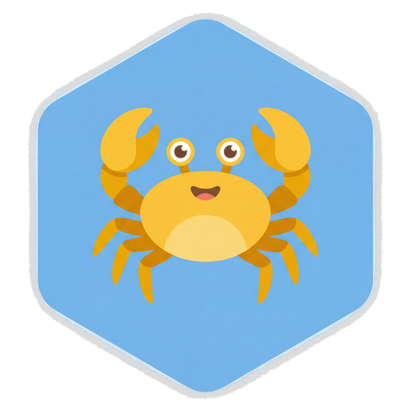

<div align="center">

[English](README.en.md) | **中文**



# HexClaw Desktop (河蟹桌面客户端)

**企业级安全的个人 AI Agent 一体化桌面客户端**

[](https://github.com/hexagon-codes/hexclaw-desktop/actions)
[](https://github.com/hexagon-codes/hexclaw-desktop/releases)
[](https://github.com/hexagon-codes/hexclaw-desktop/blob/main/LICENSE)
[](https://github.com/hexagon-codes/hexclaw-desktop/releases)
[](https://github.com/hexagon-codes/hexclaw-desktop)

**Built with**

[](https://v2.tauri.app)
[](https://vuejs.org)
[](https://www.typescriptlang.org)
[](https://www.rust-lang.org)
[](https://go.dev)

**Powered by**

<a href="https://github.com/hexagon-codes/hexagon"></a>
<a href="https://github.com/hexagon-codes/hexclaw"></a>

[**🌐 官网 hexclaw.net**](https://hexclaw.net) · [📖 在线文档](https://hexclaw.net/zh/docs/) · [⬇️ 下载](https://github.com/hexagon-codes/hexclaw-desktop/releases)

macOS / Windows / Linux 原生运行 · Sidecar 架构本地部署 · 零云端依赖 · 数据完全私有

</div>

---

<!-- TODO: 添加应用截图
<p align="center">
  
</p>
-->

## 功能特性

| 功能 | 说明 |
|------|------|
| **AI 对话** | 多模型支持: OpenAI / DeepSeek / Anthropic / Gemini / Qwen / Ollama，流式输出，Markdown 渲染，代码高亮 |
| **本地模型 (Ollama)** | 一键检测/关联本地 Ollama，自动发现已下载模型，状态机管理（检测→运行→关联），LM Studio/llama.cpp 走 OpenAI 兼容接入 |
| **Agent 编排** | 自定义 Agent 角色/目标/背景，多 Agent 协作 (Handoff + Orchestrate + Spawn)，Agent 会议模式，角色模板库 |
| **自主 Agent** | Budget 三维预算兜底 (token/时间/金额)，代码执行沙箱 (macOS Seatbelt/Linux Namespace/Windows 5 层隔离)，Checkpoint 长任务恢复 |
| **工具审批** | 危险工具 WebSocket 实时审批 (ToolApprovalCard)，safe/sensitive/dangerous 三级风险分类，"始终允许"记忆 |
| **Skill 系统** | 技能市场 + 自定义技能 + LLM 创建新 Skill (SkillWriter + 安全扫描)，Skill Chain 链式调用，依赖管理，Tool 注册与 Per-tool 权限 |
| **MCP 协议** | Model Context Protocol 工具集成 (stdio/SSE/Streamable HTTP)，OAuth 2.0+PKCE 认证，命令白名单安全校验，一键安装+持久化，工具注解解析 |
| **工作流画布** | 可视化拖拽编排 Agent 工作流，DAG 图执行引擎 |
| **知识库 (RAG)** | 文档上传/解析/向量检索，支持 PDF / Markdown / TXT 等格式；Auto-RAG 自动检索知识库注入上下文 (score >= 0.35) |
| **记忆系统** | 长期记忆 + 短期记忆 + 语义搜索，跨会话记忆持久化，VectorMemory 向量语义回忆 |
| **工具智能** | 工具结果缓存 (LRU+TTL)，Per-tool 超时+指数退避重试，工具执行指标收集 (JSONL)，MCP 结构化日志+轮转 |
| **安全网关** | Prompt 注入检测 / 工具输出清洗 (HTML/Unicode/LLM 分隔符) / PII 过滤 / 内容过滤 / RBAC 权限控制 / SSRF 防护 |
| **文件操作** | Agent 可读/写/编辑 workspace 文件 (ReadSkill/WriteSkill/EditSkill)，路径校验+symlink 防护 |
| **定时任务** | Cron 调度，周期性执行 Agent 任务 |
| **IM 通道** | 飞书 / 钉钉 / 企微 / 微信 / Slack / Discord / Telegram，通过 IM 远程与 AI 对话 |
| **深度研究** | 4 阶段自主调研（搜索→分析→综合→报告），基于 Hexagon Plan-and-Execute 引擎 |
| **文档解析** | 聊天中直接上传 PDF / Word / Excel / CSV，自动提取文本作为上下文 |
| **Webhook 通知** | 企微 / 飞书 / 钉钉机器人 Webhook 推送，任务完成自动通知 |
| **ClawHub 技能市场** | 浏览、语义搜索 (TF-IDF)、安装社区 Skill/MCP，Hub 依赖自动解析 |
| **首次引导** | 3 步 Welcome 向导（选 Provider → 选模型 → 测试连接），零配置门槛 |
| **实时日志** | WebSocket 流式日志，Agent 执行链路全程追踪 |
| **多语言** | 中文 / English，vue-i18n 国际化 |
| **系统托盘** | 最小化到托盘，托盘菜单快捷操作 |
| **全局快捷键** | `⌘+Shift+H` 随时唤起 Quick Chat 窗口 |
| **自动更新** | Tauri Updater，应用内一键升级 |

## 生态链

```
toolkit → ai-core → hexagon → hexclaw → hexclaw-desktop
                                       → hexclaw-ui
                                       → hexagon-ui
```

| 项目 | 定位 | 语言 |
|------|------|------|
| [toolkit](https://github.com/hexagon-codes/toolkit) | 通用工具箱 — 基础设施库 (日志/配置/HTTP/并发/错误链) | Go |
| [ai-core](https://github.com/hexagon-codes/ai-core) | AI 能力底座 — LLM Provider/Embedding/向量/记忆 | Go |
| [hexagon](https://github.com/hexagon-codes/hexagon) | 全能 AI Agent 框架 — ReAct/Plan-and-Execute/Tool 调度 | Go |
| [hexclaw](https://github.com/hexagon-codes/hexclaw) | 河蟹后端 — Sidecar 服务 (RESTful API/RAG/Cron/安全网关) | Go |
| [hexclaw-hub](https://github.com/hexagon-codes/hexclaw-hub) | 技能市场数据 — 在线技能目录 (`index.json` + Markdown 技能) | 数据仓库 |
| **hexclaw-desktop** | **河蟹桌面客户端 (本仓库)** | **Rust + Vue 3** |
| [hexclaw-ui](https://github.com/hexagon-codes/hexclaw-ui) | 河蟹 Web 端 — Web 客户端 (同时作为桌面端 UI 渲染层复用) | Vue 3 |
| [hexagon-ui](https://github.com/hexagon-codes/hexagon-ui) | Agent 观测台 — 可观测性面板 (链路追踪/推理回放/性能分析) | Vue 3 |

## 架构

```
HexClaw.app
┌───────────────────────────────────────────────────────────────────┐
│  Tauri Shell (Rust)                                               │
│  窗口管理 · 系统托盘 · 原生菜单 · 全局快捷键 · 单实例 · 自动更新  │
│  API 代理 (CORS bypass) · Sidecar 进程管理                        │
├───────────────────────────────────────────────────────────────────┤
│  Vue 3 前端 (WebView)                                             │
│  ┌────────┬────────┬────────┬────────┬────────┬────────┬───────┐ │
│  │Overview│  Chat  │ Agents │知识中心 │ 自动化 │  集成   │  日志 │ │
│  │        │        │        │文档|记忆│任务|画布│技能|MCP │       │ │
│  │        │        │        │        │        │IM|诊断  │       │ │
│  └───┬────┴───┬────┴───┬────┴───┬────┴───┬────┴───┬────┴───────┘ │
│      │  Pinia Store    │  Vue Router      │  Tauri invoke (IPC)   │
├──────┴─────────────────┴──────────────────┴───────────────────────┤
│  Tauri Commands (Rust → Go)                                       │
│  check_engine_health · proxy_api_request · get_sidecar_status     │
│  backend_chat · stream_chat · restart_sidecar · get_platform_info │
├───────────────────────────────────────────────────────────────────┤
│  HTTP / WebSocket  ←→  localhost:16060                            │
├───────────────────────────────────────────────────────────────────┤
│  hexclaw serve (Go Sidecar)                                       │
│  Agent 引擎 · LLM 路由 · RAG · MCP · CORS · 安全网关 · Cron      │
│  ┌────────────────────────────────────────────────────────────┐   │
│  │  Hexagon Framework  ←  ai-core (LLM/Tool/Memory)          │   │
│  │                     ←  toolkit (Log/Config/HTTP/Concurrency)│   │
│  └────────────────────────────────────────────────────────────┘   │
└───────────────────────────────────────────────────────────────────┘
```

设计模式与 **Docker Desktop 管理 Docker Engine** 一致 — Tauri 壳管理 Go Sidecar 进程。
前后端通过 **Tauri IPC 代理**通信（解决 WebView CORS 限制），完全解耦。

> Go Sidecar 默认监听 `localhost:16060`，可通过 hexclaw 配置文件修改端口。

## 技术栈

| 层 | 技术 | 版本 |
|----|------|------|
| 桌面框架 | Tauri | v2 |
| 前端框架 | Vue 3 (Composition API) | 3.5+ |
| 语言 | TypeScript | 5.9+ |
| 状态管理 | Pinia | 3.x |
| UI 组件库 | Naive UI + 自定义设计系统 | - |
| 样式 | Tailwind CSS | 4.x |
| 路由 | Vue Router | 5.x |
| 国际化 | vue-i18n | 11.x |
| 图标 | Lucide Vue | - |
| Markdown | markdown-it + Shiki (代码高亮) | - |
| 文档解析 | pdfjs-dist + mammoth + xlsx | - |
| 数据存储 | SQLite (tauri-plugin-sql) + Tauri Store | - |
| HTTP 客户端 | ofetch (前端) / reqwest (Rust 代理) | - |
| 构建工具 | Vite | 7.x |
| 测试 | Vitest + @vue/test-utils | - |
| Lint | ESLint + oxlint + Prettier | - |
| 后端 Sidecar | hexclaw serve (Go) | Go 1.25+ |
| Agent 框架 | Hexagon | - |
| Rust 层 | Tauri Shell + 插件生态 | Rust 2021 edition |

## 安装

### 一键安装 (macOS)

```bash
curl -fsSL https://raw.githubusercontent.com/hexagon-codes/hexclaw-desktop/main/install.sh | bash
```

自动检测 CPU 架构（Apple Silicon / Intel），下载最新版并安装到 `/Applications`，无需手动处理 Gatekeeper 拦截。

### Homebrew (macOS)

```bash
brew tap hexagon-codes/tap
brew install --cask hexclaw
```

后续升级：`brew upgrade --cask hexclaw`

### GitHub Releases

前往 [Releases](https://github.com/hexagon-codes/hexclaw-desktop/releases) 下载对应平台安装包：

| 平台 | 格式 |
|------|------|
| macOS (Apple Silicon) | `.dmg` |
| macOS (Intel) | `.dmg` |
| Windows | `.msi` / `.exe` (NSIS) |
| Linux | `.deb` / `.AppImage` |

> **macOS 用户注意**：浏览器直接下载的 `.dmg` 可能被 Gatekeeper 拦截。推荐使用上方的一键安装脚本或 Homebrew 安装，它们会自动处理 Gatekeeper 问题。
> 如果手动下载安装，在终端执行 `xattr -cr /Applications/HexClaw.app` 即可解除拦截。

### CI / 打包 / Release 流程

- `push / PR -> CI`: 自动运行 lint、type-check、test、web build
- `Actions -> Package -> Run workflow`: 手动构建各平台测试安装包，产物保存在 workflow artifacts
- `git tag vX.Y.Z && git push origin vX.Y.Z -> Release`: 构建并发布正式 GitHub Release 安装包
- 正式版发布后自动更新 [Homebrew Tap](https://github.com/hexagon-codes/homebrew-tap)（计算 DMG SHA256 → 推送 Cask 更新）

正式发布前需要满足：

- `package.json` 与 `src-tauri/tauri.conf.json` 的版本号和 tag 一致
- `src-tauri/tauri.conf.json` 中已写入 Tauri updater 公钥 `plugins.updater.pubkey`
- GitHub Actions secrets 已配置 `TAURI_SIGNING_PRIVATE_KEY`、`TAURI_SIGNING_PRIVATE_KEY_PASSWORD`
- macOS 发布额外需要 Apple 代码签名 secrets：`APPLE_CERTIFICATE`、`APPLE_CERTIFICATE_PASSWORD`
- macOS 发布还需要一组 notarization 凭据（任选其一）：
- Apple ID 方式：`APPLE_ID`、`APPLE_PASSWORD`、`APPLE_TEAM_ID`
- App Store Connect 方式：`APPLE_API_KEY`、`APPLE_API_ISSUER`、`APPLE_API_PRIVATE_KEY`（workflow 会自动生成 `private_keys/AuthKey_<APPLE_API_KEY>.p8`）

如果缺少这些 macOS secrets，`Release` / `Package` workflow 现在会直接失败，避免继续产出会被 Gatekeeper 判定为“已损坏”的浏览器下载包。

如果你已经拿到 `.p12` 和 `AuthKey_*.p8`，可以直接运行：

```bash
make macos-release-secrets-help
make macos-release-bootstrap-help
```

完整 Apple 侧准备步骤见 [macOS 正式发布准备](docs/macos-release.md)。

详细使用说明请参阅 [使用指南](docs/guide.md)（[English Guide](docs/guide.en.md)）。

## 开发

### 前置要求

| 工具 | 版本要求 | 说明 |
|------|---------|------|
| Node.js | >= 20.19 或 >= 22.12 | JavaScript 运行时 |
| pnpm | >= 9 | 包管理器 |
| Rust | stable (2021 edition) | Tauri 编译 |
| Go | >= 1.25 | Sidecar 编译 |

### 快速开始

```bash
# 1. 克隆仓库
git clone https://github.com/hexagon-codes/hexclaw-desktop.git
cd hexclaw-desktop

# 2. 安装依赖
make install
# 等价于: pnpm install && cd src-tauri && cargo fetch

# 3. 编译 Go sidecar (首次需要，默认拉取远程 GitHub hexclaw v0.2.2)
make sidecar

# 4. 启动开发模式
make dev
```

> **注意**:
> - `make sidecar` 默认会从 `https://github.com/hexagon-codes/hexclaw.git` 拉取 `refs/tags/v0.2.2` 到 `/tmp/hexclaw-gith-src` 并编译
> - 如需切换后端版本，可显式指定：`make sidecar HEXCLAW_REF=refs/tags/<tag>`
> - 技能市场默认读取 `https://github.com/hexagon-codes/hexclaw-hub` 的 `v0.0.1` 标签；运行时可在 `~/.hexclaw/hexclaw.yaml` 的 `skills.hub` 覆盖

### Make 命令

| 命令 | 说明 |
|------|------|
| `make dev` | 开发模式 (Vite HMR + Tauri 窗口) |
| `make build` | 构建生产版本 |
| `make build-web` | 仅构建前端 |
| `make sidecar` | 编译 Go sidecar (当前平台) |
| `make sidecar-all` | 交叉编译所有平台 sidecar |
| `make lint` | 代码检查 (oxlint + ESLint) |
| `make lint-fix` | 代码检查并自动修复 |
| `make format` | 代码格式化 (Prettier) |
| `make type-check` | TypeScript 类型检查 |
| `make test` | 运行单元测试 |
| `make clean` | 清理构建产物 |
| `make install` | 安装所有依赖 |

### 项目结构

```
hexclaw-desktop/
├── src/                          # Vue 3 前端源码
│   ├── api/                      # API 客户端 (Tauri IPC + HTTP fallback)
│   │   ├── client.ts             # HTTP/WS/IPC 基础客户端
│   │   ├── chat.ts               # 聊天 API (WebSocket + HTTP 回退)
│   │   ├── agents.ts             # Agent 管理 API
│   │   ├── skills.ts             # Skill + ClawHub 市场 API
│   │   ├── canvas.ts             # 工作流画布 API
│   │   ├── mcp.ts                # MCP 协议 API
│   │   ├── knowledge.ts          # 知识库 API
│   │   ├── memory.ts             # 记忆系统 API
│   │   ├── tasks.ts              # 定时任务 API
│   │   ├── config.ts             # LLM 配置 API (Tauri 代理)
│   │   ├── desktop.ts            # 桌面功能 API (通知/剪贴板)
│   │   ├── im-channels.ts        # IM 通道 API (飞书/钉钉/企微等)
│   │   ├── team.ts               # 团队协作 API
│   │   ├── voice.ts              # 语音 API (TTS/STT)
│   │   ├── webhook.ts            # Webhook 通知 API
│   │   ├── websocket.ts          # 聊天 WebSocket 客户端
│   │   ├── logs.ts               # 日志 API + WebSocket 流
│   │   ├── settings.ts           # 设置 API
│   │   └── system.ts             # 系统信息 API
│   ├── components/               # 组件
│   │   ├── layout/               # 布局 (AppLayout/Sidebar/TitleBar/ContextBar/DetailPanel)
│   │   ├── chat/                 # 聊天 (ChatInput/SessionList/MarkdownRenderer/ToolApprovalCard/BudgetPanel/ToolCallBubble/AgentBadge 等)
│   │   ├── settings/            # 设置组件 (OllamaCard 本地 LLM 管理)
│   │   ├── agent/                # Agent (AgentCard/AgentForm/AgentStatus/AgentConference)
│   │   ├── agents/               # 多 Agent 协作 (AgentConference)
│   │   ├── artifacts/            # 产物 (ArtifactsPanel/ArtifactPreview/ArtifactCodeView/ArtifactDiffView)
│   │   ├── inspector/            # 右侧详情 (InspectorContext/ContextCard/KeyValueRow/TimelineItem)
│   │   ├── canvas/               # 画布 (TemplateGallery)
│   │   ├── settings/             # 设置 (SettingsNotification/SettingsSecurity)
│   │   ├── logs/                 # 日志 (LogEntry/LogFilter/LogStats)
│   │   └── common/               # 通用 (CommandPalette/ConfirmDialog/Toast/ErrorBoundary 等)
│   ├── views/                    # 页面视图
│   │   ├── DashboardView.vue     # 仪表板 (概览统计 + 最近活动)
│   │   ├── ChatView.vue          # AI 对话 (会话/附件/Artifacts/模型切换)
│   │   ├── AgentsView.vue        # Agent 管理 (模板/运行中/规则/会议)
│   │   ├── KnowledgeCenterView.vue # 知识中心 (文档 + 记忆 Tab)
│   │   ├── KnowledgeView.vue     # 知识库 (文档 CRUD/上传/搜索)
│   │   ├── MemoryView.vue        # 记忆管理 (编辑/搜索/清空)
│   │   ├── AutomationView.vue    # 自动化 (任务 + 画布 Tab)
│   │   ├── TasksView.vue         # 定时任务 (Cron 管理)
│   │   ├── CanvasView.vue        # 工作流画布 (DAG 编排)
│   │   ├── IntegrationView.vue   # 集成 (技能 + MCP + IM + 诊断 Tab)
│   │   ├── SkillsView.vue        # Skill 管理 + ClawHub 市场
│   │   ├── McpView.vue           # MCP 管理 (服务器/工具/测试)
│   │   ├── IMChannelsView.vue    # IM 通道管理 (飞书/钉钉/企微等)
│   │   ├── LogsView.vue          # 日志查看 (实时流/过滤/统计)
│   │   ├── SettingsView.vue      # 设置 (LLM/安全/通知/Webhook/主题/语言)
│   │   ├── AboutView.vue         # 关于 (独立窗口)
│   │   ├── QuickChatView.vue     # 快捷聊天 (独立窗口)
│   │   └── WelcomeView.vue       # 首次引导 (Provider → 模型 → 测试)
│   ├── stores/                   # Pinia 状态管理 (thin store，业务逻辑委托 services/)
│   │   ├── app.ts                # 全局状态 (连接/侧边栏/详情面板)
│   │   ├── chat.ts               # 聊天 (会话/消息/流式/Artifacts, SQLite 持久化)
│   │   ├── agents.ts             # Agent 角色
│   │   ├── canvas.ts             # 画布 (节点/边/工作流/运行)
│   │   ├── logs.ts               # 日志 (WebSocket 流/过滤/统计)
│   │   └── settings.ts           # 设置 (LLM + 安全 + 通知, Tauri Store 持久化)
│   ├── composables/              # 组合式函数
│   │   ├── useHexclaw.ts         # hexclaw 连接状态 + 健康检查轮询
│   │   ├── useWebSocket.ts       # WebSocket 封装 (自动重连)
│   │   ├── useSSE.ts             # SSE 流式请求
│   │   ├── useShortcuts.ts       # 应用内快捷键 (⌘1~7 切页面)
│   │   ├── useTheme.ts           # 主题 (深色/浅色/跟随系统)
│   │   ├── useAutoStart.ts       # 开机自启 (Tauri autostart)
│   │   ├── useAutoUpdate.ts      # 自动更新 (Tauri updater)
│   │   ├── useValidation.ts      # 表单校验
│   │   ├── useKeyboardNav.ts     # 键盘导航 + 焦点陷阱
│   │   ├── usePlatform.ts        # 平台检测 (macOS/Windows/Linux)
│   │   ├── useChatSend.ts        # 发送消息 + Auto-RAG 知识库检索
│   │   ├── useChatActions.ts     # 聊天操作 (重发/编辑/删除等)
│   │   └── useConversationAutomation.ts # 会话自动化 (自动标题等)
│   ├── services/                 # 业务逻辑服务层
│   │   ├── chatService.ts        # 聊天服务 (WebSocket/HTTP 发送)
│   │   └── messageService.ts     # 消息服务 (消息构建/持久化)
│   ├── i18n/                     # 国际化 (中文/英文)
│   ├── router/                   # 路由 (基于 navigation.ts 动态生成)
│   ├── types/                    # TypeScript 类型定义
│   ├── utils/                    # 工具函数
│   │   └── file-parser.ts        # 文档解析器 (PDF/Word/Excel/CSV)
│   ├── db/                       # 本地数据库 (SQLite: chat/artifacts/knowledge/templates/outbox)
│   ├── config/                   # 前端配置
│   │   ├── env.ts                # 环境配置
│   │   ├── navigation.ts         # 导航注册表 (三层分组: 核心/集成/系统)
│   │   └── providers.ts          # LLM Provider 配置
│   └── assets/                   # 静态资源 (Logo/图标/IM Logo)
├── src-tauri/                    # Tauri (Rust) 层
│   ├── src/
│   │   ├── main.rs               # 入口
│   │   ├── lib.rs                # 应用初始化 & 插件注册
│   │   ├── commands.rs           # Tauri IPC 命令 (健康检查/API 代理/流式聊天)
│   │   ├── sidecar.rs            # Go Sidecar 进程管理
│   │   ├── tray.rs               # 系统托盘
│   │   ├── menu.rs               # macOS 原生菜单
│   │   └── window.rs             # 窗口管理 & 全局快捷键
│   ├── binaries/                 # Go sidecar 二进制 (编译生成)
│   ├── icons/                    # 应用图标
│   ├── capabilities/             # Tauri v2 权限配置
│   ├── tauri.conf.json           # Tauri 配置
│   ├── build.rs                  # Rust 构建脚本
│   └── Cargo.toml                # Rust 依赖
├── docs/                         # 文档
│   ├── guide.md                  # 使用指南 (中文)
│   ├── guide.en.md               # 使用指南 (英文)
│   ├── updates.md                # 自动更新发布说明 (中文)
│   ├── updates.en.md             # 自动更新发布说明 (英文)
│   ├── overview.md               # 产品总览 (中文)
│   └── overview.en.md            # 产品总览 (英文)
├── homebrew/                     # Homebrew Cask 定义 + 更新脚本
├── install.sh                    # macOS 一键安装脚本
├── scripts/                      # CI/构建脚本
├── .github/                      # GitHub CI/CD
├── Makefile                      # 开发命令
├── vite.config.ts                # Vite 配置
├── vitest.config.ts              # Vitest 测试配置
├── eslint.config.ts              # ESLint 配置
├── tsconfig.json                 # TypeScript 配置
├── package.json                  # Node 依赖
├── LICENSE                       # Apache 2.0 许可证
└── README.md
```

## 构建

### 生产构建

```bash
# 完整构建 (前端 + Tauri 打包)
make build

# 输出位置:
#   macOS: src-tauri/target/release/bundle/macos/HexClaw.app
#   DMG:   src-tauri/target/release/bundle/dmg/HexClaw_*.dmg
```

### 指定目标平台构建

```bash
# macOS Intel
npx @tauri-apps/cli build --target x86_64-apple-darwin

# macOS Apple Silicon
npx @tauri-apps/cli build --target aarch64-apple-darwin
```

### Sidecar 交叉编译

```bash
# 编译所有平台
make sidecar-all

# 或单独编译指定平台
make sidecar-darwin-arm64    # macOS Apple Silicon
make sidecar-darwin-amd64    # macOS Intel
make sidecar-linux-amd64     # Linux x86_64
make sidecar-windows-amd64   # Windows x86_64
```

Sidecar 二进制输出到 `src-tauri/binaries/` 目录，Tauri 打包时会自动内嵌。构建时会注入真实的 tag / commit / built 时间，方便在已安装应用里核对后端版本。

## 测试

```bash
# 运行单元测试
pnpm test:unit

# 或使用 Make
make test
```

测试文件规范：
- 测试文件与源码同目录，命名为 `*.test.ts` 或 `*.spec.ts`
- Store 测试放在 `src/stores/__tests__/` 目录
- 使用 Vitest + @vue/test-utils

## 常见问题

### macOS 提示"无法打开"或"已损坏"

推荐使用一键安装脚本或 Homebrew 安装（自动处理 Gatekeeper）：

```bash
# 方式 1：一键安装
curl -fsSL https://raw.githubusercontent.com/hexagon-codes/hexclaw-desktop/main/install.sh | bash

# 方式 2：Homebrew
brew tap hexagon-codes/tap && brew install --cask hexclaw
```

如果已经手动下载了 DMG，在终端执行：

```bash
xattr -cr /Applications/HexClaw.app
```

### 侧边栏显示 "Engine stopped" 但后端已启动

1. 确认 hexclaw 进程在运行: `ps aux | grep hexclaw`
2. 确认端口监听正常: `curl http://localhost:16060/health`
3. 如果 curl 成功但前端仍显示 stopped，检查是否是旧版本应用（重新 `make build` 并安装最新版本）

### `make sidecar` 编译失败

1. 确认 Go >= 1.23 已安装: `go version`
2. 确认能访问 GitHub 并成功拉取远程源码: `git ls-remote --tags https://github.com/hexagon-codes/hexclaw.git v0.2.2`
3. 确认 Rust 工具链已安装 (用于检测平台 triple): `rustc -vV`

### `make dev` 启动后白屏

Sidecar 可能未编译或端口冲突。检查：
1. 确认已执行 `make sidecar`
2. 确认 `16060` 端口未被占用: `lsof -i :16060`

### hexclaw 后端启动失败

1. 查看错误日志: `~/.hexclaw/hexclaw.log`
2. 直接运行 sidecar 查看输出: `./src-tauri/binaries/hexclaw-$(rustc -vV | grep host | awk '{print $2}') serve --desktop`
3. 即使未配置 LLM API Key，hexclaw 也应该能正常启动（LLM 功能降级，基础 API 仍可用）

## 贡献指南

### 工作流程

1. Fork 本仓库
2. 创建功能分支: `git checkout -b feat/your-feature`
3. 提交更改: `git commit -m "feat: 添加新功能"`
4. 推送分支: `git push origin feat/your-feature`
5. 创建 Pull Request

### 代码规范

- **格式化**: `make format` (Prettier)
- **检查**: `make lint` (ESLint + oxlint，只检查不修改文件)
- **类型检查**: `make type-check` (vue-tsc)

### Commit Message 格式

遵循 [Conventional Commits](https://www.conventionalcommits.org/) 规范：

```
feat: 添加新功能
fix: 修复问题
docs: 文档更新
style: 代码格式调整
refactor: 重构
test: 测试相关
chore: 构建/工具链
```

## 在线资源

- 🌐 官网: [hexclaw.net](https://hexclaw.net)
- 📖 中文文档: [hexclaw.net/zh/docs](https://hexclaw.net/zh/docs/)
- 📖 English Docs: [hexclaw.net/en/docs](https://hexclaw.net/en/docs/)
- 🐙 GitHub: [hexagon-codes/hexclaw-desktop](https://github.com/hexagon-codes/hexclaw-desktop)

## 联系我们

- 官网: [hexclaw.net](https://hexclaw.net)
- GitHub Issues: [hexclaw-desktop/issues](https://github.com/hexagon-codes/hexclaw-desktop/issues)
- 河蟹 AI: ai@hexclaw.net
- 河蟹支持: support@hexclaw.net

### 微信公众号

关注 HexClaw 微信公众号，获取最新动态、使用教程和版本更新：

<p align="center">
  
</p>

## License

[Apache License 2.0](LICENSE)
