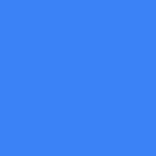

<p align="center">
  
</p>

<h1 align="center">HexClaw Desktop</h1>

<p align="center">
  企业级安全的个人 AI Agent 一体化桌面客户端
</p>

<p align="center">
  <a href="https://github.com/everyday-items/hexclaw-desktop/actions"></a>
  <a href="https://github.com/everyday-items/hexclaw-desktop/releases"></a>
  <a href="https://github.com/everyday-items/hexclaw-desktop/blob/main/LICENSE"></a>
  <a href="https://github.com/everyday-items/hexclaw-desktop/releases"></a>
</p>

---

<!-- TODO: 添加应用截图
<p align="center">
  
</p>
-->

## 功能特性

| 功能 | 说明 |
|------|------|
| **AI 聊天** | 多模型支持: OpenAI / DeepSeek / Anthropic / Gemini / Qwen / Ollama，流式输出，Markdown 渲染，代码高亮 |
| **Agent 角色** | 自定义角色名称/目标/背景故事，多 Agent 协作，角色模板库 |
| **Skill 系统** | 技能市场 + 自定义技能，Tool 注册与权限管理 |
| **工作流画布** | 可视化拖拽编排 Agent 工作流，DAG 图执行引擎 |
| **MCP 协议** | Model Context Protocol 工具集成，外部工具即插即用 |
| **知识库** | 文档上传/解析/向量检索，支持 PDF/Markdown/TXT 等格式 |
| **记忆系统** | 长期记忆 + 短期记忆 + 语义搜索，跨会话记忆持久化 |
| **定时任务** | Cron 调度，周期性执行 Agent 任务 |
| **安全网关** | Prompt 注入检测 / PII 过滤 / 内容过滤 / RBAC 权限控制 |
| **实时日志** | WebSocket 流式日志，Agent 执行链路全程追踪 |
| **多语言** | 中文 / English，vue-i18n 国际化 |
| **系统托盘** | 最小化到托盘，托盘菜单快捷操作 |
| **全局快捷键** | 随时唤起 Quick Chat 窗口 |
| **自动更新** | Tauri Updater，应用内一键升级 |

## 架构

```
HexClaw.app
┌─────────────────────────────────────────────────────────────────┐
│  Tauri Shell (Rust)                                             │
│  窗口管理 · 系统托盘 · 全局快捷键 · 单实例 · 自动更新 · Sidecar │
├─────────────────────────────────────────────────────────────────┤
│  Vue 3 前端 (WebView)                                           │
│  ┌──────┬────────┬────────┬────────┬───────┬────────┬────────┐ │
│  │ 聊天  │ Agent  │ Skills │ 画布   │ 知识库 │ 记忆   │ 设置   │ │
│  │ Chat  │ Roles  │ Market │ Canvas │  KB   │ Memory │ Config │ │
│  └──┬───┴───┬────┴───┬────┴───┬────┴───┬───┴───┬────┴───┬────┘ │
│     │  Pinia Store   │  Vue Router     │  API Client (ofetch)  │ │
├─────┴────────────────┴─────────────────┴───────────────────────┤
│  HTTP / WebSocket  ←→  localhost:16060                          │
├─────────────────────────────────────────────────────────────────┤
│  hexclaw serve (Go Sidecar)                                     │
│  Agent 引擎 · LLM 路由 · RAG · MCP · 安全网关 · 日志 · Cron    │
│  ┌──────────────────────────────────────────────────────────┐   │
│  │  Hexagon Framework  ←  ai-core (LLM/Tool/Memory)        │   │
│  └──────────────────────────────────────────────────────────┘   │
└─────────────────────────────────────────────────────────────────┘
```

前后端通过 HTTP API + WebSocket 通信，完全解耦。
设计模式与 **Docker Desktop 管理 Docker Engine** 一致 — Tauri 壳管理 Go Sidecar 进程。

## 技术栈

| 层 | 技术 | 版本 |
|----|------|------|
| 桌面框架 | Tauri | v2 |
| 前端框架 | Vue 3 (Composition API) | 3.5+ |
| 语言 | TypeScript | 5.9+ |
| 状态管理 | Pinia | 3.x |
| UI 组件库 | Naive UI | 2.44+ |
| 样式 | Tailwind CSS | 4.x |
| 路由 | Vue Router | 5.x |
| 国际化 | vue-i18n | 11.x |
| 图标 | Lucide Vue | - |
| Markdown | markdown-it + Shiki (代码高亮) | - |
| HTTP 客户端 | ofetch | - |
| 构建工具 | Vite | 7.x |
| 测试 | Vitest + @vue/test-utils | - |
| Lint | ESLint + oxlint + Prettier | - |
| 后端 Sidecar | hexclaw serve (Go) | Go 1.23+ |
| Agent 框架 | Hexagon | - |
| Rust 层 | Tauri Shell + 插件生态 | Rust 2021 edition |

## 安装

### Homebrew (macOS)

```bash
brew install --cask hexclaw
```

### GitHub Releases

前往 [Releases](https://github.com/everyday-items/hexclaw-desktop/releases) 下载对应平台安装包：

| 平台 | 格式 |
|------|------|
| macOS (Apple Silicon) | `.dmg` |
| macOS (Intel) | `.dmg` |
| Windows | `.msi` / `.exe` (NSIS) |
| Linux | `.deb` / `.AppImage` |

> 首次打开 macOS 版本可能需要在 **系统设置 → 隐私与安全性** 中允许运行。

## 开发

### 前置要求

| 工具 | 版本要求 | 说明 |
|------|---------|------|
| Node.js | >= 20.19 或 >= 22.12 | JavaScript 运行时 |
| pnpm | >= 9 | 包管理器 |
| Rust | stable | Tauri 编译需要 |
| Go | >= 1.23 | Sidecar 编译需要 |

### 快速开始

```bash
# 1. 克隆仓库
git clone https://github.com/everyday-items/hexclaw-desktop.git
cd hexclaw-desktop

# 2. 安装依赖
make install
# 等价于: pnpm install && cd src-tauri && cargo fetch

# 3. 编译 Go sidecar (首次需要)
make sidecar

# 4. 启动开发模式
make dev
```

### Make 命令

| 命令 | 说明 |
|------|------|
| `make dev` | 开发模式 (Vite HMR + Tauri 窗口) |
| `make build` | 构建生产版本 |
| `make build-web` | 仅构建前端 |
| `make sidecar` | 编译 Go sidecar (当前平台) |
| `make sidecar-all` | 交叉编译所有平台 sidecar |
| `make lint` | 代码检查 (oxlint + ESLint) |
| `make format` | 代码格式化 (Prettier) |
| `make type-check` | TypeScript 类型检查 |
| `make test` | 运行单元测试 |
| `make clean` | 清理构建产物 |
| `make install` | 安装所有依赖 |

### 项目结构

```
hexclaw-desktop/
├── src/                          # Vue 3 前端源码
│   ├── api/                      # API 客户端 (与 Go sidecar 通信)
│   │   ├── client.ts             # HTTP/WS 基础客户端
│   │   ├── chat.ts               # 聊天 API
│   │   ├── agents.ts             # Agent 管理 API
│   │   ├── skills.ts             # Skill API
│   │   ├── canvas.ts             # 工作流画布 API
│   │   ├── mcp.ts                # MCP 协议 API
│   │   ├── knowledge.ts          # 知识库 API
│   │   ├── memory.ts             # 记忆系统 API
│   │   ├── tasks.ts              # 定时任务 API
│   │   ├── logs.ts               # 日志 API
│   │   ├── settings.ts           # 设置 API
│   │   └── system.ts             # 系统信息 API
│   ├── components/               # 组件
│   │   ├── chat/                 # 聊天组件
│   │   ├── agent/                # Agent 组件
│   │   ├── common/               # 通用组件
│   │   ├── layout/               # 布局组件
│   │   └── logs/                 # 日志组件
│   ├── views/                    # 页面视图
│   │   ├── ChatView.vue          # 聊天页
│   │   ├── QuickChatView.vue     # 快捷聊天
│   │   ├── AgentsView.vue        # Agent 管理
│   │   ├── SkillsView.vue        # Skill 市场
│   │   ├── CanvasView.vue        # 工作流画布
│   │   ├── McpView.vue           # MCP 管理
│   │   ├── KnowledgeView.vue     # 知识库
│   │   ├── MemoryView.vue        # 记忆管理
│   │   ├── TasksView.vue         # 定时任务
│   │   ├── LogsView.vue          # 日志查看
│   │   ├── SettingsView.vue      # 设置
│   │   └── WelcomeView.vue       # 欢迎页
│   ├── stores/                   # Pinia 状态管理
│   ├── composables/              # 组合式函数
│   ├── i18n/                     # 国际化资源
│   ├── router/                   # 路由配置
│   ├── types/                    # TypeScript 类型定义
│   ├── utils/                    # 工具函数
│   ├── config/                   # 前端配置
│   └── assets/                   # 静态资源
├── src-tauri/                    # Tauri (Rust) 层
│   ├── src/                      # Rust 源码
│   ├── binaries/                 # Go sidecar 二进制
│   ├── icons/                    # 应用图标
│   ├── capabilities/             # Tauri 权限配置
│   ├── tauri.conf.json           # Tauri 配置
│   └── Cargo.toml                # Rust 依赖
├── Makefile                      # 开发命令
├── package.json                  # Node 依赖
└── README.md
```

## 构建

### 生产构建

```bash
# 完整构建 (前端 + Tauri 打包)
make build

# 输出位置: src-tauri/target/release/bundle/
```

### Sidecar 交叉编译

```bash
# 编译所有平台
make sidecar-all

# 或单独编译指定平台
make sidecar-darwin-arm64    # macOS Apple Silicon
make sidecar-darwin-amd64    # macOS Intel
make sidecar-linux-amd64     # Linux x86_64
make sidecar-windows-amd64   # Windows x86_64
```

Sidecar 二进制输出到 `src-tauri/binaries/` 目录，Tauri 打包时会自动内嵌。

## 测试

```bash
# 运行单元测试
pnpm test:unit

# 或使用 Make
make test
```

测试文件规范：
- 测试文件与源码同目录，命名为 `*.test.ts` 或 `*.spec.ts`
- Store 测试放在 `src/stores/__tests__/` 目录
- 使用 Vitest + @vue/test-utils

## 贡献指南

### 工作流程

1. Fork 本仓库
2. 创建功能分支: `git checkout -b feat/your-feature`
3. 提交更改: `git commit -m "feat: 添加新功能"`
4. 推送分支: `git push origin feat/your-feature`
5. 创建 Pull Request

### 代码规范

- **格式化**: `make format` (Prettier)
- **检查**: `make lint` (ESLint + oxlint)
- **类型检查**: `make type-check` (vue-tsc)

### Commit Message 格式

遵循 [Conventional Commits](https://www.conventionalcommits.org/) 规范：

```
feat: 添加新功能
fix: 修复问题
docs: 文档更新
style: 代码格式调整
refactor: 重构
test: 测试相关
chore: 构建/工具链
```

## 相关项目

| 项目 | 说明 | 仓库 |
|------|------|------|
| **Hexagon** | Go AI Agent 框架 (核心引擎) | [hexagon](https://github.com/everyday-items/hexagon) |
| **ai-core** | AI 基础能力库 (LLM/Tool/Memory) | [ai-core](https://github.com/everyday-items/ai-core) |
| **toolkit** | Go 通用工具库 | [toolkit](https://github.com/everyday-items/toolkit) |
| **hexagon-ui** | Hexagon Dev UI 观测面板 (Vue 3) | [hexagon-ui](https://github.com/everyday-items/hexagon-ui) |
| **hexclaw** | HexClaw Go 后端 (Sidecar) | [hexclaw](https://github.com/everyday-items/hexclaw) |
| **hexclaw-ui** | HexClaw Web 前端 (Vue 3) | [hexclaw-ui](https://github.com/everyday-items/hexclaw-ui) |

## License

[MIT](LICENSE)
