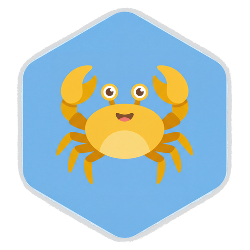
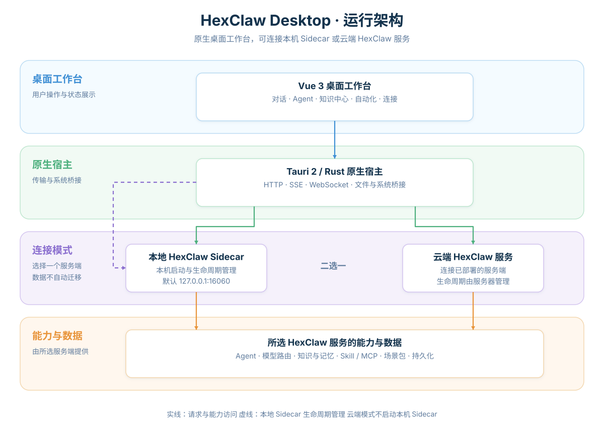
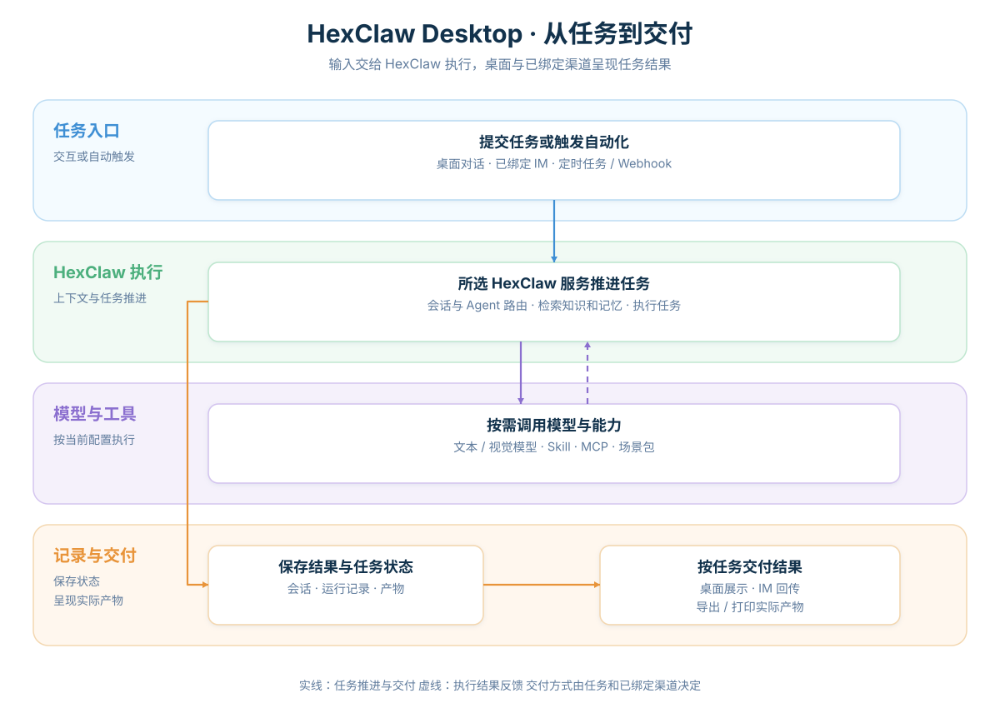
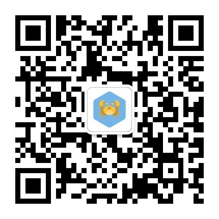

<div align="center">



# HexClaw Desktop

**河蟹 AI 的原生桌面工作台：对话、智能体、知识、工具与自动化。**

[](https://github.com/hexagon-codes/hexclaw-desktop/actions/workflows/ci.yml)
[](https://github.com/hexagon-codes/hexclaw-desktop/releases)
[](LICENSE)

[安装](#安装) · [首次使用](#首次使用) · [官网](https://hexclaw.net) · [使用指南](docs/guide.md) · [下载](https://github.com/hexagon-codes/hexclaw-desktop/releases) · [English](README.en.md)

</div>

HexClaw Desktop 用一个桌面应用连接 [HexClaw](https://github.com/hexagon-codes/hexclaw) Agent 服务。你可以直接使用应用管理的本机服务，也可以连接自己部署的云端服务；从桌面对话、已绑定的 IM 通道或自动化任务发起工作，由智能体调用模型、知识与工具，返回可查看、保存和交付的结果。

应用采用 **Tauri 2 + Vue 3 + TypeScript**，本机 Agent 服务通过 Go Sidecar 运行。选择本地模型时可使用 Ollama；选择在线模型时需要对应 Provider 的网络连接和凭据。

> 本 README 描述当前源码能力。已发布安装包包含对应发布版本的代码，最新源码与安装包可能存在差异。


上图复用[官方 K12 教程](https://hexclaw.net/zh/docs/k12)的真实界面与专属皮肤。教程适用 Desktop `v0.5.0-beta.3` / HexClaw `v0.5.0-beta.1`，截图沿用 `v0.5.0-beta` 场景基线；作业素材为 **AI 生成示例 · 非真实学生作业**。

## 目录

- [安装](#安装)
- [首次使用](#首次使用)
- [核心能力](#核心能力)
- [运行架构](#运行架构)
- [任务如何完成](#任务如何完成)
- [源码开发](#源码开发)
- [Claude Code 开发实战 SOP](#claude-code-开发实战-sop)
- [文档与生态](#文档与生态)
- [参与贡献](#参与贡献)
- [联系我们](#联系我们)
- [许可证](#许可证)

## 安装

### 运行要求

- **macOS**：当前随包的本地推理与文档渲染组件需要 macOS 14 及以上；支持 Apple Silicon 与 Intel。应用外壳配置的 macOS 11 下限不代表这些组件的兼容范围。
- **Windows / Linux**：当前发布目标为 x86_64。Linux 发布构建使用 Ubuntu 22.04，运行环境需要满足 Tauri 的 WebKitGTK 4.1 等依赖。
- **模型**：在线模型需要所选 Provider 的网络连接和凭据。macOS 安装包包含 Ollama；Windows 与 Linux 使用本地模型时，需要另行安装 [Ollama](https://ollama.com/download) 并下载模型。

安装包以所选 [Release](https://github.com/hexagon-codes/hexclaw-desktop/releases) 的实际资产和版本要求为准，使用安装包无需 Node.js、Rust 或 Go。

### macOS：一键安装（推荐）

在终端运行以下命令：

```bash
curl -fsSL https://raw.githubusercontent.com/hexagon-codes/hexclaw-desktop/bb3c12ec91eec91798b67c292bc8c85c4481dc2b/install.sh | bash
```

脚本自动识别 Apple Silicon / Intel，下载已公开的安装包（含预发布版），并安装到 `/Applications/HexClaw.app`。安装后从启动台打开，或运行 `open -a HexClaw`。

### macOS：Homebrew

```bash
brew tap hexagon-codes/tap
brew install --cask hexclaw
```

升级已安装版本：

```bash
brew upgrade --cask hexclaw
```

macOS 发行版未使用 Apple Developer ID 签名或公证。一键安装脚本与 Homebrew Cask 会处理应用安装；手动下载后遇到系统拦截时，参阅[使用指南中的 macOS 安全提示](docs/guide.md#macos-安全提示)。

### macOS、Windows 与 Linux：安装包

从 [GitHub Releases](https://github.com/hexagon-codes/hexclaw-desktop/releases) 选择版本和对应平台的资产：

| 平台 | 架构 | 安装格式 |
| --- | --- | --- |
| macOS | Apple Silicon / Intel | `.dmg` |
| Windows | x86_64 | `.exe`（NSIS） |
| Linux | x86_64 | `.deb` / `.AppImage` |

发布构建覆盖上述四个目标；下载时以所选 Release 实际提供的资产为准。

## 首次使用

1. **选择服务。** 首次设置中选择本机服务，或填写云端 HexClaw 的服务地址和访问令牌。
2. **确认模型。** 当前服务已有可用默认模型时可直接发起任务；未配置时再进入模型设置。在线模型填写所需凭据和地址并测试连接，本地模型确认 Ollama 与已下载模型可用，无需云端 API Key。
3. **发起任务。** 回到“会话”页面发送消息或附件。需要专属角色时，在智能体页面创建实例；需要私有资料或外部工具时，再配置知识库、Skill、MCP 或连接。

首次体验可发送：“用 Markdown 列出开源项目 README 的三项检查：快速开始、API 契约、版本一致性。”**收到完整回答，且输入区恢复可发送状态**，说明这次对话已完成。模型连接测试通过只说明连接可用，不能代替任务结果。

本机服务由应用管理启动与停止。云端服务由服务器管理；服务器、模型与已绑定 IM 持续可用时，电脑关机不会停止云端任务。

**两种服务分别保存自己的会话、学习记录、模型配置和连接。切换服务不会自动迁移或合并数据。** 在线模型会接收任务中发送给它的内容，数据处理方式取决于所选 Provider。

### 使用作业辅导场景

当前作业辅导场景面向小学。在智能体模板中创建作业辅导助手并填写孩子档案，然后进入该实例的辅导会话发送作业图片。图片任务自动推进到结果；可识别部分正常处理，无法可靠辨认的部分标注为“无法识别”。

图片作业批改的完成标准是**收到可查看的带批注原图**。识题文本或处理中间态不代表批改完成；完整演示与更多截图见[官方 K12 教程](https://hexclaw.net/zh/docs/k12)。

学习档案保存错题与积累，学情视图汇总学习情况，周练结合教材、课程进度和已有学习记录生成练习。当前源码支持课程进度估算，并保留手动调整的进度来源；具体教材与练习范围以服务可用资料为准。

### 首次使用遇到问题

| 现象 | 检查入口 |
| --- | --- |
| macOS 拦截手动下载的应用 | [macOS 安全提示](docs/guide.md#macos-安全提示) |
| 服务显示未连接或引擎停止 | [服务连接排查](docs/guide.md#引擎状态红灯-engine-stopped)，分别检查本机进程或云端地址、访问令牌 |
| 已连接但没有收到回答或产物 | [对话无响应](docs/guide.md#对话无响应)，检查当前服务的模型配置和任务日志 |

## 核心能力

| 能力 | 可以完成的工作 |
| --- | --- |
| 对话与结果展示 | 多轮对话、流式回答、附件输入、模型切换与推理参数；渲染 Markdown、代码、数学公式和化学式，查看生成文件与 Artifact。 |
| 智能体与场景 | 管理角色、模板和默认 Agent，在“连接”中配置通道路由；通过场景包为 Agent 实例装配专属能力。 |
| K12 作业辅导 | 为孩子建立独立档案；图片解题与批改、作文与美术点评、错题和学习积累、周练与学情报告，按任务提供批注图、练习与导出产物。 |
| 知识与记忆 | 上传和管理文档，查看处理状态、重试失败任务，使用全文与向量检索为对话补充上下文；管理持久记忆。 |
| 工具与集成 | 在“能力”中管理 Skill、技能市场、MCP 服务和 Prompt；让 Agent 调用已配置的外部工具与服务。 |
| 自动化 | 创建定时任务、Webhook 与工作流，让任务按计划或事件触发。 |
| 连接 | 管理 IM 通道、账号和数据连接器，将外部消息接入 Agent 执行链路。 |
| 桌面体验与诊断 | 系统托盘、快捷聊天、通知、文件预览、导出与打印；查看运行日志和服务状态。 |

模型可通过 OpenAI、Anthropic、Gemini、DeepSeek、Qwen 等 Provider 以及 OpenAI 兼容接口接入。Ollama 用于本地模型；具体可用模型、输入类型和工具能力取决于当前服务配置与 Provider 支持。

## 运行架构



| 层次 | 职责 |
| --- | --- |
| Vue 工作台 | 展示会话、智能体、知识库、自动化、连接、能力、日志和设置。 |
| Tauri 原生宿主 | 管理窗口、托盘、通知、文件与系统操作，并承接 HTTP、SSE 和 WebSocket 传输。 |
| 本机 HexClaw Sidecar | 在当前设备执行 Agent 与业务任务，默认使用 `localhost:16060`，由应用管理生命周期。 |
| 云端 HexClaw 服务 | 在部署服务器执行任务和保存业务数据，桌面通过服务地址与访问令牌连接。 |
| 模型、知识与工具 | 按任务使用配置的 Provider、检索、记忆、Skill、MCP 和场景能力。 |

本机与云端使用同一套桌面任务入口。云端模式仍通过本机 Tauri 完成文件选择、预览和系统操作，但启动应用时不会启动本机 HexClaw Sidecar 或托管 Ollama；任务请求发往当前选中的云端服务。

本机专属的进程管理与内部接口只适用于本机服务。模型、工具、数据连接器访问的是**执行服务所在环境**可用的资源，连接云端后不会自动获得本机文件系统或本机工具环境。

本机 Provider 配置与 API Key 持久化在 `~/.hexclaw/hexclaw.yaml`，业务数据由本机服务保存。安装包同时提供 Pandoc 和 Typst，用于对应任务的文档渲染；随包组件说明见 [THIRD_PARTY.md](THIRD_PARTY.md)。

## 任务如何完成



桌面对话、已绑定 IM 和自动化提供任务入口；Agent 根据角色与任务使用知识、记忆和工具。执行状态与结果保存在当前服务，桌面呈现回答和产物，IM 任务通过对应通道回传；导出、打印等交付方式按任务能力提供。

作业辅导会根据任务返回批注图、讲解、学习记录或练习文档，支持在桌面查看和通过已绑定通道接收结果。

图示下载：[架构 PNG](.github/assets/desktop-architecture.png) · [任务流程 PNG](.github/assets/desktop-task-workflow.png)。

## 源码开发

### 环境要求

| 工具 | 要求 |
| --- | --- |
| Node.js | `20.19.x` 及以上的 20 系列，或 `22.12.0` 及以上；CI 使用 Node.js 22。 |
| pnpm | `10.30.3`，由 `package.json` 锁定。 |
| Rust | `1.94.0`，由 `rust-toolchain.toml` 锁定。 |
| Go | 1.25.13 及以上，用于编译当前主线 HexClaw Sidecar；指定其他后端版本时以其 `go.mod` 为准。 |
| 系统工具 | Git、Make；渲染组件下载需要 Python 3 和 curl。 |
| 平台依赖 | 按 [Tauri 2 前置要求](https://v2.tauri.app/start/prerequisites/) 安装对应系统依赖。 |

### macOS 快速开始

```bash
git clone https://github.com/hexagon-codes/hexclaw-desktop.git
cd hexclaw-desktop

pnpm install --frozen-lockfile

# 编译 Makefile 指定版本的后端，并准备随包组件
make sidecar
make render-bundle
make ollama

# 启动 Vue 开发服务与 Tauri 桌面窗口
make dev
```

`make sidecar` 使用 `Makefile` 中的 `HEXCLAW_REF`，不会自动选择最新后端源码。需要使用后端最新主分支时，可显式运行：

```bash
make sidecar HEXCLAW_REF=origin/main
```

需要指定其他后端版本时，将 `HEXCLAW_REF` 设置为对应 tag 或提交。Windows 和 Linux 的原生构建依赖及随包组件准备方式见 [Release 工作流](.github/workflows/release.yml)；上面的 `make render-bundle` 快速路径适用于 macOS。

### 使用本地生态源码

同时开发后端与桌面时，将 `hexclaw`、`ai-core`、`hexagon`、`toolkit` 放在桌面仓库的同级目录，并在父目录的 `go.work` 中引用这些模块，然后运行：

```bash
make sidecar-local
make render-bundle
make ollama
make dev
```

`make sidecar-local` 从本地 Go workspace 构建后端，包含该工作区的已提交代码与未提交改动。修改 Go 代码后需要重新构建 Sidecar；Vue 前端在开发模式下使用 Vite 热更新。

### 常用命令

| 命令 | 用途 |
| --- | --- |
| `pnpm dev` | 仅启动前端开发服务；需要可访问的 HexClaw 服务。 |
| `make dev` | 启动 Tauri 桌面开发模式。 |
| `make sidecar` | 编译指定后端版本的当前平台 Sidecar。 |
| `make sidecar-local` | 编译同级 Go workspace 中的最新本地 Sidecar。 |
| `pnpm type-check` | 检查 TypeScript 与 Vue 类型。 |
| `pnpm lint` | 运行 oxlint 和 ESLint。 |
| `pnpm build` | 类型检查并构建前端。 |
| `make build` | 使用已准备的随包组件生成原生安装包。 |
| `make package-local` | macOS 下基于完整本地生态 workspace 重建并生成本机安装产物。 |

`make build` 默认也生成 updater 制品，需要匹配的 Tauri updater 签名密钥。仅构建本机手动安装包时，可按[本地打包说明](docs/updates.md#本地打包)在本次构建中关闭 updater 制品生成；这不修改项目默认配置或发布流程。

### 代码导览

| 路径 | 内容 |
| --- | --- |
| [`src/views/`](src/views/) | 工作台页面。 |
| [`src/features/`](src/features/) | 场景功能与领域视图，包括 K12。 |
| [`src/api/`](src/api/) | 服务 API 与原生传输适配。 |
| [`src/components/`](src/components/) | 共享交互与展示组件。 |
| [`src-tauri/src/`](src-tauri/src/) | 原生宿主、服务连接、进程管理与文件桥接。 |
| [`release/`](release/) | 随包渲染组件与发布准备脚本。 |
| [`.github/workflows/`](.github/workflows/) | CI 与多平台发布构建。 |

## Claude Code 开发实战 SOP

这个仓库同时记录了用 Claude Code 开发 HexClaw 的实际工作流。设计驱动、测试闭环与多 Agent 协作的方法，以及可复用的命令、Hooks、Skill 和模板，均已开源。

- **公众号文章**：[《河蟹 AI 背后的 Claude Code SOP：设计驱动 × 测试闭环 × 多 Agent 协作》](https://mp.weixin.qq.com/s/1rza-Ye3NF89KNAJp_PttA)，介绍开发过程与三条主线的具体做法。
- **开源 SOP 包**：[`docs/claude-code-practices/`](docs/claude-code-practices/)，包含 4 份实战手册、7 个 Claude Code 命令、3 个 Hooks、DevTestOps Skill 和 CLAUDE.md 模板。

| 主线 | 核心做法 |
| --- | --- |
| 设计驱动 | 先明确需求与方案，比较取舍，通过 ADR 记录设计决定。 |
| 测试闭环 | 按实际改动选择验证方法，以运行结果和真实产物确认完成。 |
| 多 Agent 协作 | Claude 编码、Codex 评审、人工决策，结合独立审查补充证据。 |

在仓库目录中，可将 SOP 包复制到 Claude Code 的个人配置目录；文件用途和 Hooks 接入方式见 [SOP 使用说明](docs/claude-code-practices/README.md)。

```bash
mkdir -p ~/.claude/commands ~/.claude/data ~/.claude/skills ~/.claude/hooks
cp docs/claude-code-practices/command/*.md ~/.claude/commands/
cp docs/claude-code-practices/data/*.md ~/.claude/data/
cp -r docs/claude-code-practices/skill/devtestops ~/.claude/skills/
cp docs/claude-code-practices/hooks/*.sh ~/.claude/hooks/
chmod +x ~/.claude/hooks/*.sh
```

## 文档与生态

| 资源 | 内容 |
| --- | --- |
| [官网](https://hexclaw.net) | 产品介绍、安装说明与版本下载。 |
| [在线中文文档](https://hexclaw.net/zh/docs/) / [English Docs](https://hexclaw.net/en/docs/) | 官方使用教程与功能说明。 |
| [使用指南](docs/guide.md) | 安装、模块使用、快捷键与故障排查。 |
| [产品总览](docs/overview.md) | 工作台模块与使用路径。 |
| [自动更新说明](docs/updates.md) | 应用更新与发布制品要求。 |
| [更新日志](CHANGELOG.md) | 各版本变更。 |

HexClaw 生态从通用基础库、模型接入和 Agent 框架，延伸到服务、桌面工作台与技能市场：

| 项目 | 定位与能力 | 技术 |
| --- | --- | --- |
| [toolkit](https://github.com/hexagon-codes/toolkit) | 通用 Go 基础库：泛型集合、并发、HTTP/SSE、缓存与配置、日志、数据库、对象存储和命令沙箱 | Go |
| [ai-core](https://github.com/hexagon-codes/ai-core) | AI 能力底座：统一模型接入、工具调用、流式与结构化输出、模型路由、Embedding，以及图像、视频和语音 | Go |
| [Hexagon](https://github.com/hexagon-codes/hexagon) | AI Agent 框架：工具调用、图编排、多 Agent、RAG、持久执行，以及 MCP、A2A 和 OpenTelemetry 集成 | Go |
| [HexClaw](https://github.com/hexagon-codes/hexclaw) | 可自托管的 AI Agent 服务：多模型、工具、知识库、长期记忆与任务自动化，支持 API 和多平台 IM 接入 | Go |
| [HexClaw Desktop](https://github.com/hexagon-codes/hexclaw-desktop)（本仓库） | AI Agent 桌面工作台：连接本机或云端 HexClaw 服务，集成对话、知识库、工具、任务自动化与 K12 作业辅导 | Tauri 2、Vue 3、TypeScript、Rust |
| [HexClaw Hub](https://github.com/hexagon-codes/hexclaw-hub) | 技能与工具市场：Markdown 技能定义、MCP 服务目录、市场索引及生成与校验工具 | Markdown、Python |

## 参与贡献

从[贡献指南](CONTRIBUTING.md)开始了解开发环境、验证范围和 Pull Request 要求。使用 [Bug 报告表单](https://github.com/hexagon-codes/hexclaw-desktop/issues/new?template=bug_report.yml)提供已有信息即可，也可以通过 [Issues](https://github.com/hexagon-codes/hexclaw-desktop/issues)讨论改进。

日志与截图请移除 API Key、访问令牌和个人数据。涉及图片、文件或 IM 时，请说明实际产物是否收到。

## 联系我们

- 官网：[hexclaw.net](https://hexclaw.net)
- 问题与建议：[GitHub Issues](https://github.com/hexagon-codes/hexclaw-desktop/issues)
- 河蟹 AI：[ai@hexclaw.net](mailto:ai@hexclaw.net)
- 河蟹支持：[support@hexclaw.net](mailto:support@hexclaw.net)

### 微信公众号

关注 HexClaw 微信公众号，获取最新动态、使用教程和版本更新：

<p align="center">
  
</p>

## 许可证

本项目采用 [Apache License 2.0](LICENSE)。随包第三方组件使用各自许可证，详见 [THIRD_PARTY.md](THIRD_PARTY.md)。
