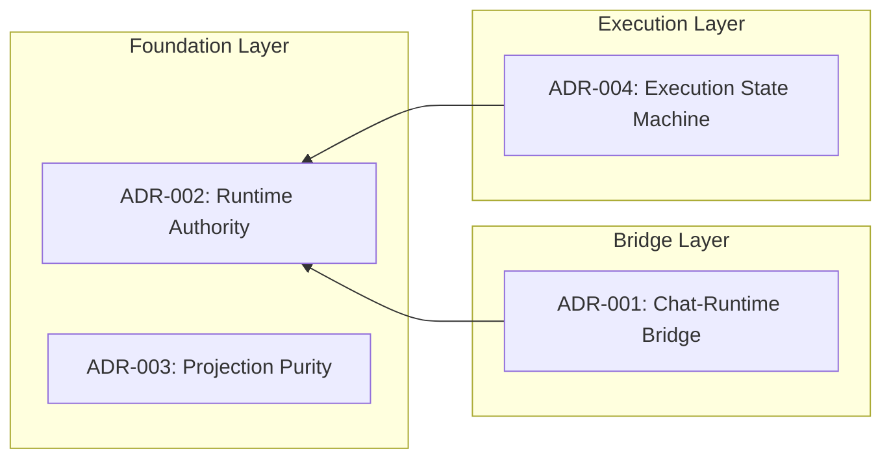

# Architecture Decision Records

本目录记录 Runtime Kernel 的架构决策。每个 ADR 记录一个已实现的架构边界，包含 Context、Decision、Constraints、Rejected Alternatives、Consequences 和 References。

## Status Legend

| Status | 含义 |
|--------|------|
| proposed | 已提议，待接受 |
| accepted | 已接受，当前有效 |
| **frozen baseline** | 已冻结为 Constitution baseline，修改需新 ADR supersede |
| deprecated | 已弃用，不推荐使用 |
| superseded | 被更新的 ADR 替代 |

## ADR Lifecycle

1. **proposed** → 写入草案，等待审查
2. **accepted** → 审查通过，当前架构的标准
3. **deprecated** → 架构演进后不再适用
4. **superseded** → 被更新的 ADR #NNN 明确替代

ADR 只记录已实现的架构决策，不记录计划中的方案。ADR 是 retrospective 的记录，不是 forward-looking 的 spec。

## v0.8 Constitution Baseline

**Runtime Constitution Baseline: v0.8** 表示 ADR-001 至 ADR-004 是当前 Runtime Kernel 的长期架构边界。这些边界已通过实际代码验证，并被冻结为 Constitution baseline。

规则：
- **冻结后不得原地修改**已冻结的 ADR 正文
- 如需演进，必须通过**新的 ADR supersede 旧 ADR**，旧 ADR 标记 superseded 并指向新 ADR
- 所有新代码必须遵守 frozen baseline 的原则
- PR 审查可直接引用 ADR 编号作为架构依据

## ADR Index

| # | Title | Status | Date | Dependencies |
|---|-------|--------|------|--------------|
| 001 | Chat-Runtime Bridge Boundary | frozen baseline | 2026-05-13 | Depends on ADR-002 |
| 002 | Runtime Authority Ownership | frozen baseline | 2026-05-13 | — |
| 003 | Projection Purity | frozen baseline | 2026-05-13 | — |
| 004 | Execution State Machine | frozen baseline | 2026-05-13 | Depends on ADR-002 |

## Dependency Map



## Cross-Reference Format

在 ADR 正文中使用以下语法引用关联 ADR：

```
参考 ADR-NNN（§SectionName）
```

反向引用同样更新。当 ADR 被 supersede 时，旧 ADR 标记 superseded 并指向新 ADR。
