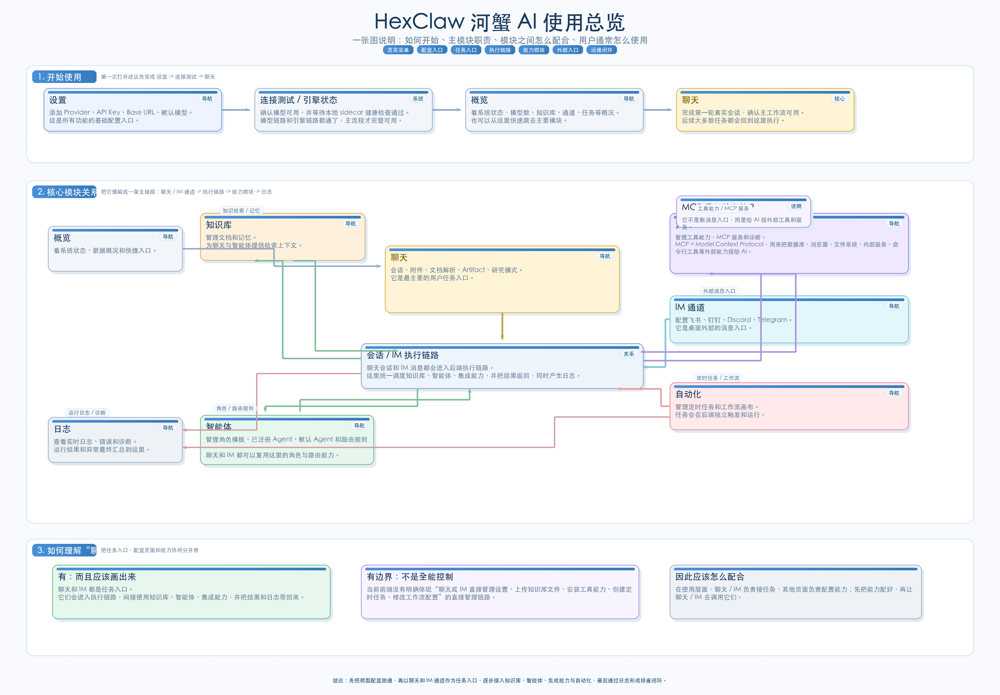

[English](overview.en.md) | **中文**

# HexClaw Desktop 产品总览

如果你第一次接触 HexClaw，建议先看这张总览图，再继续看详细使用指南。

## 这是什么

HexClaw 不是单一聊天窗口，而是一个以 `聊天` 和 `IM 通道` 为任务入口、以 `知识库 / 智能体 / 集成` 为能力底座、以 `日志` 为排查闭环的本地 AI Agent 工作台。

如果只记一句话，可以先记这个：

**先把模型配置跑通，再从聊天或 IM 发起任务，按需要接入知识库、智能体、集成和自动化，最后通过日志形成稳定闭环。**

## 第一次打开应该怎么用

建议按下面的顺序开始：

1. 进入 `设置`
2. 配好 LLM Provider、API Key、Base URL、默认模型
3. 通过 `连接测试 / 引擎状态` 确认模型链路和本地 sidecar 都正常
4. 回到 `聊天` 发起第一轮真实会话

这一步是整个系统的起点。后面的知识库、智能体、自动化、IM 通道都建立在这条链路可用的前提下。

## 主模块分别负责什么

### 概览

`概览` 用来查看系统状态、模型数、知识库、通道和任务的整体情况，也适合作为主要页面的跳转入口。

### 聊天

`聊天` 是桌面里的主要任务入口。

你可以在这里完成：

- 普通多轮对话
- 文档和附件输入
- Artifact 查看
- 研究模式任务

### IM 通道

`IM 通道` 是桌面外部的消息入口，负责把飞书、钉钉、Discord、Telegram 等接入到 HexClaw。

它的作用不是“通知”，而是“远程发起任务”。

### 知识库

`知识库` 负责管理文档和记忆，为聊天和智能体提供检索上下文。

它解决的是“模型不知道你的私有资料”这个问题。

### 智能体

`智能体` 负责管理角色模板、已注册 Agent、默认 Agent 和路由规则。

它解决的是“谁来做这件事、按什么角色做、不同场景如何分流”。

### 集成

`集成` 负责管理工具能力、MCP 服务和诊断。

这里的 `MCP` 是 `Model Context Protocol`，作用是把外部工具和服务接给 AI，例如：

- 数据库
- 浏览器能力
- 文件系统
- 内部服务
- 命令行工具

这意味着 HexClaw 里的 AI 不只是“生成答案”，还可以“调用能力”。

### 自动化

`自动化` 负责定时任务和工作流画布。

它解决的是“任务不一定等用户来点，也可以自己按计划运行”。

### 日志

`日志` 是运行结果和异常的统一排查入口。

如果 IM 没回、知识库没命中、工具没调通、任务没执行，最终都应该回到这里看。

## 模块之间怎么协同

把系统理解成一条主链路最容易：

`聊天 / IM 通道 / 自动化 -> 会话 / IM 执行链路 -> 知识库 / 智能体 / 集成 -> 日志`

这条链路对应的用户理解是：

- `聊天` 是桌面里的主要任务入口
- `IM 通道` 是桌面外部的消息入口
- `自动化` 会按计划主动触发任务
- 这些入口最终都会进入统一执行链路
- 执行链路再去调用知识库、智能体和集成能力
- 执行结果和异常最终沉淀到日志

## 聊天和 IM 能不能“指挥其他模块”

可以，但要把“任务入口”和“配置页面”分开理解。

更准确的理解方式是：

- `聊天 / IM` 负责发起任务
- `知识库 / 智能体 / 集成` 负责提供能力
- `设置 / 自动化管理 / 知识库管理 / MCP 管理` 这类页面负责完成配置

所以 HexClaw 不是“聊天直接管理所有功能”，而是“聊天通过执行链路调用其他能力”。

## 推荐的理解顺序

如果你第一次接触 HexClaw，建议按这个顺序理解：

1. 先把它看成一个本地 AI 工作台
2. 再把 `聊天` 和 `IM 通道` 看成任务入口
3. 再把 `知识库 / 智能体 / 集成` 看成能力底座
4. 再把 `自动化` 看成主动运行能力
5. 最后把 `日志` 看成问题排查闭环

## 下一步看什么

- 想看更细的使用说明，继续看 [使用指南](./guide.md)
